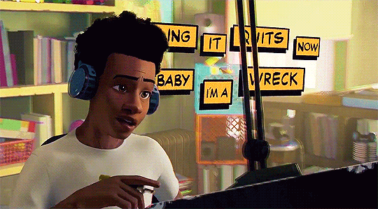
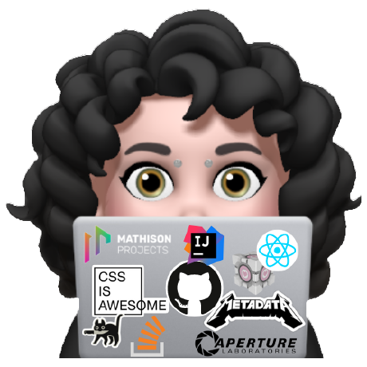

<h1 align="center">
Hi, I'm Sri Ram Prasad Adusumilli
  </h1>
  <!-- <i>I don’t just code — I teach people how to think</i> -->
 
                  

<i><h3>I don’t just code — I teach people how to think</h3></i>

 

<!--

  

-->

<b>📈About me</b>

- 🧑🏻‍💻 Exploring knowledge since **3.0+** years.

- 🏫 Education: Pursued a degree in **Computer Science & Engineering**.
  
- 🧠 **What I Believe In:**
  - **Consistency** beats talent.
  - **Teaching** is the best way to learn.
  - **Clean logic > fancy syntax**.
  - **Growth comes from discomfort.**
    
- 🥇 **Achievements:**
  - Ranked in the **top 10%** in multiple **competitive programming** contests.
  - Developed and deployed **multiple full-stack applications.**
  - Trained 500+ students, with noticeable improvement in **problem-solving confidence and placement readiness**.
    
- 🥅 **2026 Goals:** Learn more about **BackEnd**.
- **🚀 Direction:** Actively growing towards a strong Product / Backend Engineering role with deep DSA foundations.
  
- 🌱**Currently:**
  - Enhancing skills in **Competitive Programming**.
  - Learning **Spring & Web Development**.
  - Building scalable projects with **React, Node.js, and Express.js**.
    
- 💼 **Experience:**
  - **Tutor at Codetantra**, mentoring students in coding & problem-solving.
  - Volunteered as a **mentor** for coding bootcamps & technical training sessions.
    
- 💡**Interests:**
  - Java Programming and Spring.
  - Full Stack Web Development.
    
- 🌍 ***Website for my Coding Profiles:** [https://sri-ram-linktree.vercel.app/](https://codeninja194.vercel.app/)
- 📫 **How to reach me:** [Email](mailto:sriramadusumili98@gmail.com) | [LinkedIn](https://www.linkedin.com/in/sri-ram-prasad-adusumilli/)
  
- 💡 **Fun Fact:** I love debugging code at 3 AM, just when the best ideas strike! 🚀😆
- 🎨 **Hobbies:**
  - Learning about **new technologies & frameworks.**
  - Playing the **guitar** to unwind after coding.
  - **Traveling, exploring new places, and experiencing different cultures.**
    

		
	

 
 
 
 

## Tech. Stacks & Tools 

### ⚙️ Workstation

   
   
    

### Languages :
&nbsp;&nbsp;

### Web Dev

### Libraries/Frameworks :
&nbsp;&nbsp;
&nbsp;&nbsp;
&nbsp;&nbsp;
&nbsp;&nbsp;
&nbsp;&nbsp;

### Database Management System :
&nbsp;&nbsp;
&nbsp;&nbsp;

### 💻 Editors and Software

   
    
    
    
    
    

### 🤖 Operating Systems

    
    
    
    

 ### Hosting :
&nbsp;&nbsp;
&nbsp;&nbsp;

### Version Control :

&nbsp;&nbsp;
&nbsp;&nbsp;

<!---->
 

## GitHub Stats 

 
Details

  &nbsp;&nbsp;&nbsp;
  
  

  

## Contact 
 

	
	
	
	
	

 

## Music  

  

 <em><b>I love connecting with different people.</b> so if you want to say <b>Hi!.. I'll be happy to meet you more!</b> 😊</em>

	
<b>Visitors Count 🥽
</b>
	<!--  -->
		

